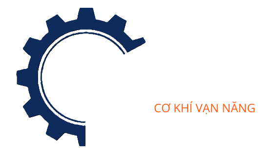

# Cơ Khí Vạn Năng - Landing Page v2

## Giới thiệu

Dự án phát triển landing page cho Công Ty TNHH Cơ Khí Vạn Năng, một công ty chuyên cung cấp dịch vụ gia công cơ khí và chế tạo máy tại Bình Dương.

> _Giải pháp gia công cơ khí & chế tạo máy_

Đây là phiên bản thứ 2 của dự án, tập trung vào việc cải thiện UI/UX và tối ưu hóa trải nghiệm người dùng để thu hút khách hàng hiệu quả hơn.

## Mục tiêu dự án

-   Tạo landing page hiện đại, dễ sử dụng để thu hút khách hàng tiềm năng
-   Trình bày rõ ràng các dịch vụ chính của công ty: Tiện, Hàn, Phay, CNC & Thiết kế 3D
-   Cung cấp thông tin liên hệ dễ dàng và nhiều phương thức kết nối
-   Giới thiệu chuyên môn và kinh nghiệm của ban lãnh đạo

## Công nghệ sử dụng

-   **Frontend framework:** Next.js
-   **Styling:** Figma (design) và SCSS
-   **Deployment:** Vercel

## Thông tin công ty

-   **Tên công ty:** Công Ty TNHH Cơ Khí Vạn Năng
-   **Mã số thuế:** 3703143102
-   **Địa chỉ:** 522, Tổ 1, Khu Phố 8, Uyên Hưng, Tân Uyên, Bình Dương
-   **Điện thoại:** +84 944 432 430
-   **Email:** cokhivannang@gmail.com
-   **Giờ làm việc:** Thứ 2 - Thứ 7, 7:30 AM - 4:30 PM

## Dịch vụ chính

1. **Tiện chính xác** - Đảm bảo độ chính xác cao với tay nghề giàu kinh nghiệm
2. **Hàn chuyên nghiệp** - Áp dụng nhiều phương pháp hàn từ truyền thống đến hiện đại
3. **Phay đa trục** - Xử lý linh hoạt các bề mặt phức tạp
4. **CNC & Thiết kế 3D** - Cung cấp giải pháp cắt dây CNC chính xác và dịch vụ thiết kế 3D

## Liên hệ & Mạng xã hội

-   [Facebook](https://www.facebook.com/profile.php?id=61572695349782)
-   [Zalo](https://zalo.me/2444516135385989317)
-   [Google Maps](https://maps.app.goo.gl/WywqoKf8pGVkJzuCA)

---
